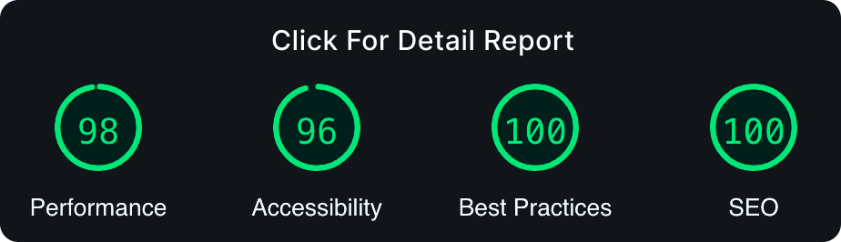
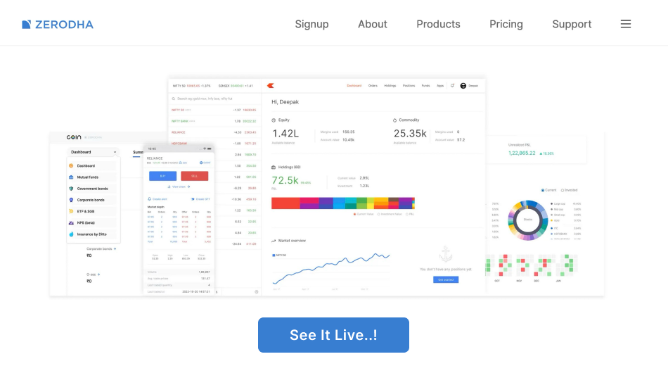

<a href="https://zerodha-landing-replica.vercel.app/">
  <h1 align="center">Zerodha Clone</h1>
</a>

<p align="center">
  Replication of the `zerodha.com` Homepage, created as part of Week-0 Assignment for the 100xDevs Cohort by Harkirat Singh. 
</p>

<a href="https://lighthouse-metrics.com/lighthouse/checks/8d118c63-e6ca-452f-8c9e-776f67c519f6/runs/47501c63-ef71-4f32-8466-123e6eb03379">
   <p align=center>
    
  <p>
</a>

<div align= "center">

[](https://twitter.com/KadlagAkash) &nbsp; [](https://www.linkedin.com/in/kadlagakash/) &nbsp; [](mailto:akashkadlag14@gmail.com) &nbsp; [](https://conventionalcommits.org)&nbsp; [](https://choosealicense.com/licenses/mit/)

</div>

<h2 align="center">

[🚀&nbsp; Explore Demo](https://zerodha-landing-replica.vercel.app/) &nbsp;&nbsp;&nbsp;&nbsp;&nbsp; [📂&nbsp; Source Code](https://github.com/KadlagAkash/zerodha-landing-replica)

</h2>
<br>

<p align="center">
  <a href="#introduction"><strong>Introduction</strong></a> 
	·&nbsp;<a href="#features"><strong>Features</strong></a> 
	·&nbsp;<a href="#tech-stack"><strong>Tech Stack</strong></a>
	·&nbsp;<a href="#local-development"><strong>Development Setup</strong></a> 
</p>
<br>

## <a name="introduction">❄️&nbsp; Introduction</a>

This project meticulously replicates the Zerodha website, crafted as part of Week-0's assignment for the 100xDevs Cohort by Harkirat Singh.

<a href="https://zerodha-landing-replica.vercel.app/">
   <p align=center>
    
  <p>
</a>
<br>

## <a name="features">🔋&nbsp; Features</a>

- **Modular CSS Design**: Maintainable and scalable styles.

- **Consistent Color Palette** and **Typography**: Ensuring visual harmony.

- **Image Optimization**: Enhancing performance with faster load times.

- **Clean and Organized Codebase**: Structured and easy to comprehend.

- **Subtle Animations**: Elevating user experience.

- Improved Search Engine Visibility **(SEO Friendly)**: Enhancing online discoverability.

- **Validated HTML/CSS**: Ensuring compatibility and standards adherence.

- **Responsive Design**: Accessibility across various devices.

- **Version Control with Git**: Efficient tracking and collaboration.

- **Efficient Development Workflow with Parcel**: Streamlining the development process.
  <br><br>

## <a name="tech-stack">⚙️&nbsp; Tech Stack</a>

- [HTML5](https://developer.mozilla.org/en-US/docs/Web/HTML) – structuring
- [Modular CSS3](https://developer.mozilla.org/en-US/docs/Web/CSS) – CSS
- [Git](https://git-scm.com/) – versioning
- [Parcel](https://parceljs.org/) – building
- [AOS Library](https://michalsnik.github.io/aos/) – Animation Effects
- [Vercel](https://vercel.com/) – deployments
  <br><br>

## <a name="local-development">🖥️&nbsp;&nbsp; Local Development</a>

1. **Clone the repository:**

   ```bash
   git clone https://github.com/KadlagAkash/zerodha-landing-replica.git
   ```

2. **Navigate to the project directory:**

   ```bash
   cd zerodha-landing-replica
   ```

3. **Install dependencies:**

   ```bash
   npm install
   ```

4. **Run the project:**

   ```bash
   npm start
   ```

5. **Open your browser:**

   Visit [http://localhost:1234](http://localhost:1234) to view the Zerodha Clone.

6. **Build the project for production:**
   ```bash
   npm run build
   ```
   <br>

## 📋&nbsp;&nbsp; Usage Instructions

Simply navigate through the replicated Zerodha website to explore its features.
<br><br>

## 🪪&nbsp;&nbsp; Licensing Information

- This project is open-source and intended for learning purposes only.
- Please be aware that Zerodha, the original website's owner, may have legal rights over their intellectual property.
- It is crucial to use this project responsibly and refrain from any commercial or inappropriate use.
