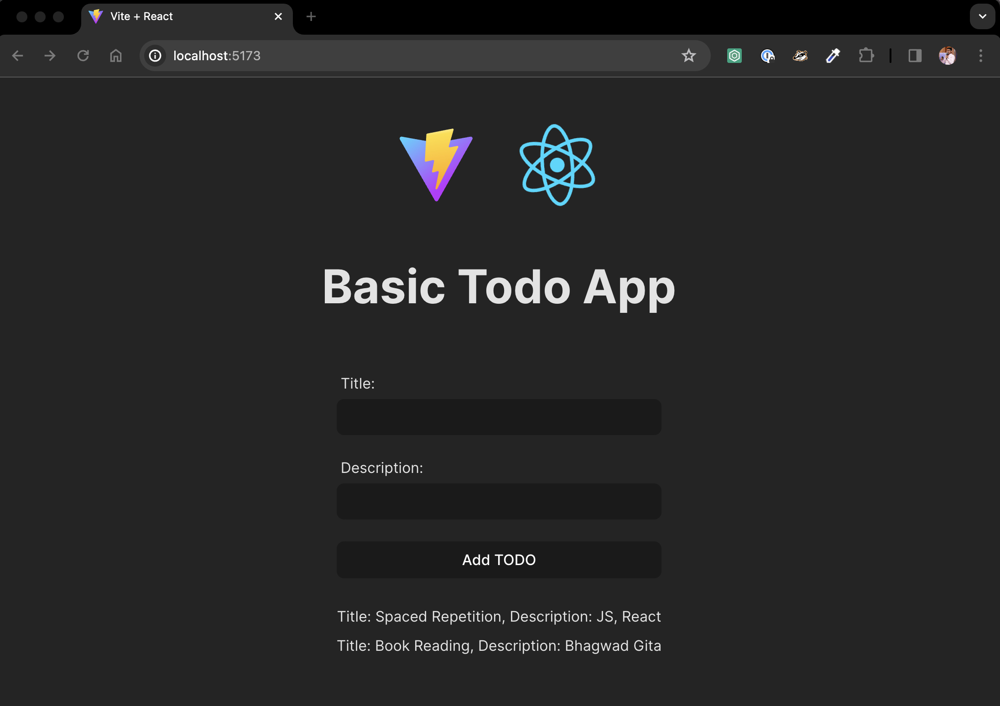

## Introduction to React

Develop a simple React application with [Vite](https://vitejs.dev/), following these requirements:

- Build a basic TODO application with two input boxes for title and description. Users should be able to add TODOs, which will be displayed in a div.
- Implement the functionality using the DOM approach covered in week-4 live classes. Avoid using React state variables for now.
- Aim to migrate the original HTML/JS implementation to a React project.
  

## My Implementation
 
<a href="./src/App.jsx" align="center">
  
  <h3>See the Exact Code </h3>
</a>
