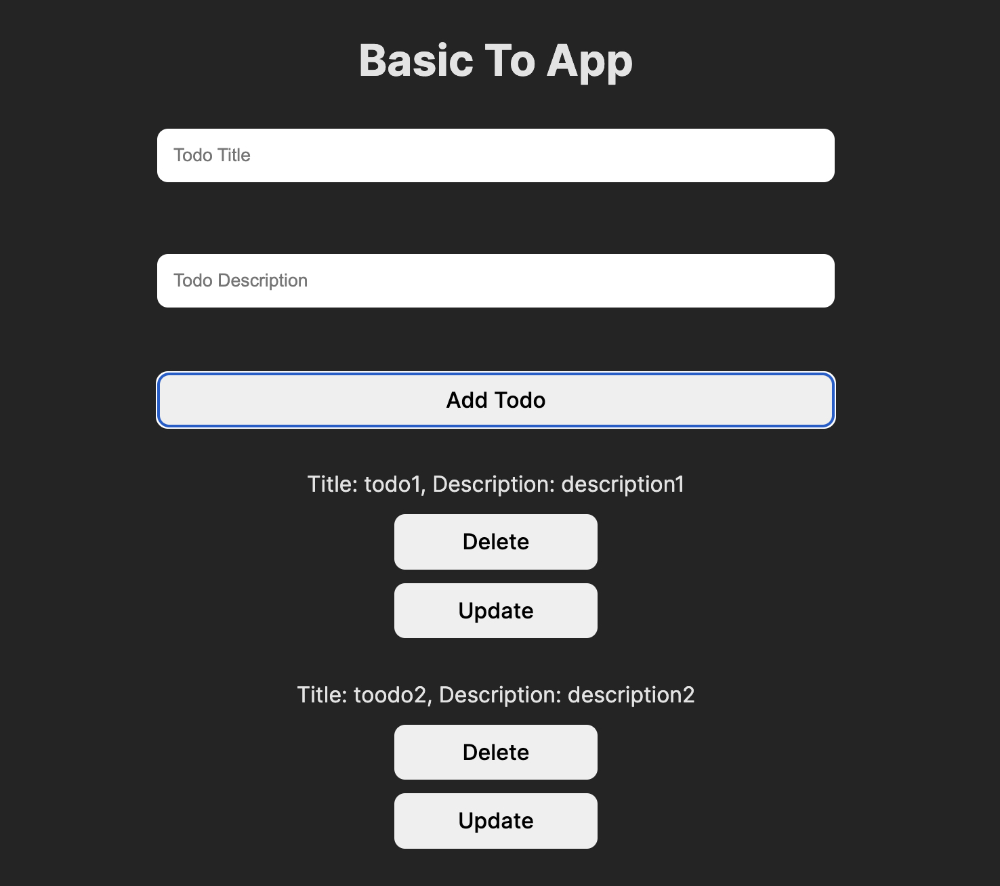

You are tasked with enhancing a frontend [TODO app](index.html) by implementing four essential functions:

- `addTodoToDom`
- `removeTodoFromDom`
- `updateTodoInDom`
- `updateState`

These functions collectively emulate the functionality of a library like React. The primary objectives are as follows:

1. Whenever the `updateState` function is invoked with a new state, it should compute the difference between `newTodos` and `oldTodos`. Subsequently, it should trigger `addTodoToDom`, `removeTodoFromDom`, or `updateState` based on the calculated differences.

2. The unique identifier for a todo is its id. If the title of a todo changes in two iterations, `updateTodoInDom` should be called.

3. The state variable's structure resembles the following:
   ```js
   const todos = [
     {
       title: 'Go to gym',
       description: 'Go to gym from 7-8PM',
       id: 1,
     },
   ];
   ```

Try to add the following features:

1. Dynamic Updates:
   Real-time addition, deletion, and updating of todos without page refresh.

2. User-Friendly Interface:
   Simple input fields for title and description.
   Intuitive buttons for adding, updating, and deleting todos.

3. Visual Representation:
   Clear display of todos with titles, descriptions, and action buttons.

4. No External Libraries:
   Develop the solution using only HTML, CSS, and JavaScript.

5. Efficient Updates:
   Update todos in place when a title changes in two iterations.

## My Implementation

<h3 align="center">

[🗂️ Source Code](./index.html)

<h3>



