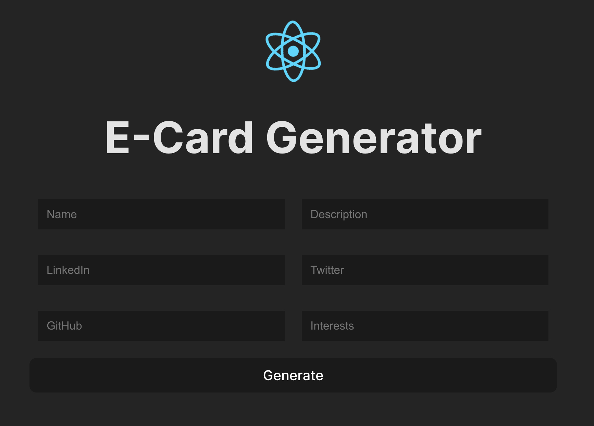
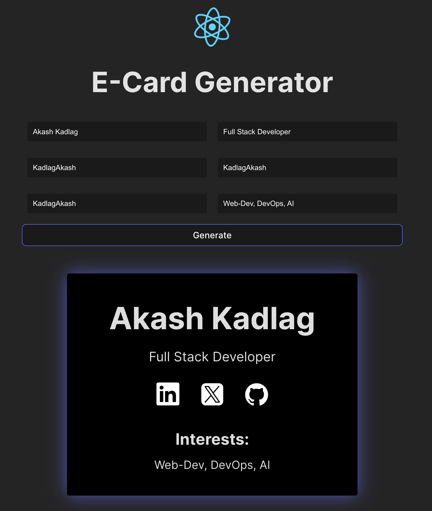

## My Implementation
<h3 align="center">

[🗂️ Source Code](./src/components/Card.jsx)

<h3>

 
 
  
  
 
 

## Workflow

- `main.jsx` component renders `App.jsx` component

- `App.jsx` component renders `Form.jsx` component which accepts user input.

- `Form.jsx` passed input data to `generateCard()` function after sumbimission which sets state variable named `cardData`.

- One we have `cardData`, `App.jsx` renders `Card.jsx` component and passes `cardData` as props.
