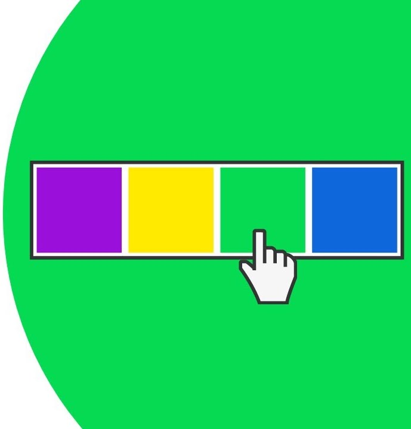
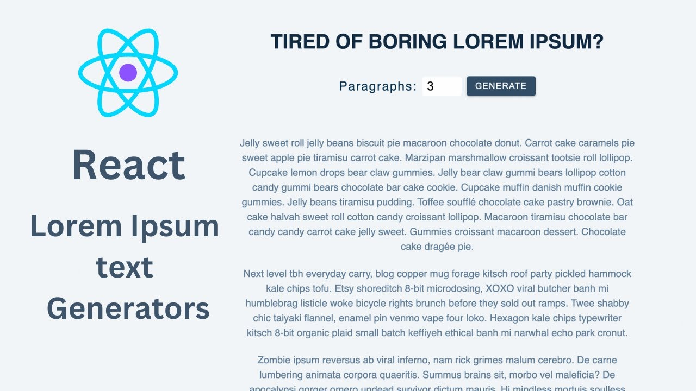
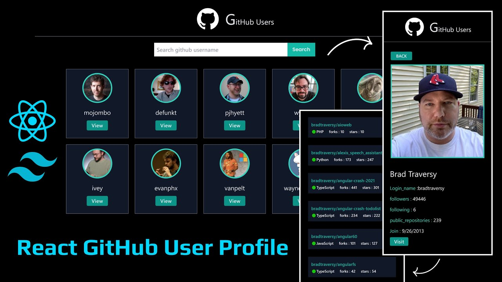
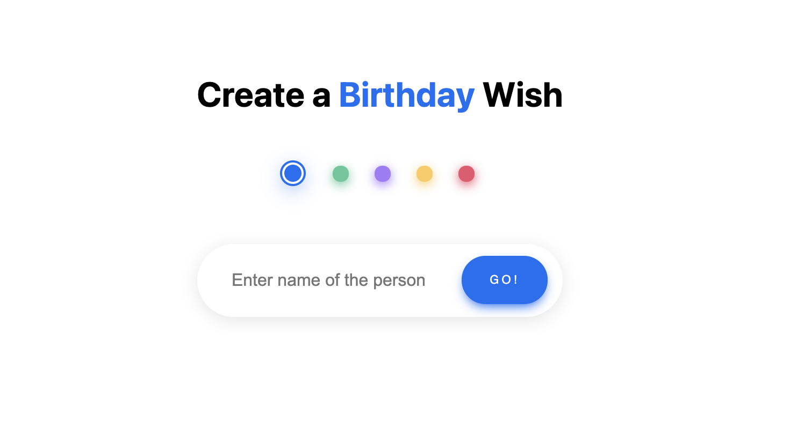

<a href="./">
  <h1 align="center">Week - 7</h1>
</a>

<p align="center">
  Welcome to my Week Seven Assignments repository! Here, you'll find solutions of all tasks.
</p>
<br>

<div align="center">

[](https://conventionalcommits.org)&nbsp; [](https://choosealicense.com/licenses/mit/)

</div>
<br>

<p align="center">
  <a href="#user-profile-component"><strong>User Profile</strong></a>
  ·&nbsp;<a href="#background-changer-component"><strong>BG Changer</strong></a>
  ·&nbsp;<a href="#paragraph-generator-component"><strong>Para Generator</strong></a>
  ·&nbsp;<a href="#github-stats-generator-component"><strong>GitHub Stats</strong></a>
  ·&nbsp;<a href="#otp-login-component"><strong>OTP Login</strong></a>
  ·&nbsp;<a href="#bday-card-component"><strong>B&apos;Day Card</strong></a>
</p>
<br>

## Problem Statements

### [User Profile Component](./src/components/Profile/README.md)

- Build a React profile component.

- It will showcase user information, such as name, picture, and bio.

<p align=center>
   
<p>

<br>

### [Background Changer Component](./src/components/BackgroundChanger/README.md)

- Create a dynamic background changer in React

- It allows users to switch between different background colors with a button click.

<p align=center>
   
<p>

<br>

### [Paragraph Generator Component](./src/components/ParaGenerator/README.md)

- Construct a paragraph generator in React.

- Users should input the desired length of words, and the generator creates a random paragraph.

<p align=center>
   
<p>

<br>

### [GitHub Stats Generator Component](./src/components/GitHubCard/README.md)

- Construct a GitHub Stats Generator in React.

- Use the GitHub API (https://api.github.com/users/${username}) to render your GitHub information as a card.

<p align=center>
   
<p>

<br>

### [OTP Login Component](./src/components/OTPLogin/README.md)

- Design and implement an OTP login system in React.

- Mimic the behavior of OTP logins on platforms like Hotstar, where the cursor automatically moves to the next digit.

<p align=center>
   
<p>

<br>

### [B'Day Card Component](./src/components/BirthdayCard/README.md)

- Develop a birthday wisher site in React.
- It takes a person's name as input and generates 2-3 visually appealing birthday wish cards.

<p align=center>
   
<p>

<br><br>

## ⚙️&nbsp; Dependencies

- [Node.js](https://nodejs.org/) – JavaScript runtime

- [React](https://react.dev/): JavaScript library for web and native UI.
  <br><br><br>

## <a name="local-development"> 🖥️&nbsp;&nbsp; Local Development</a>

Ensure you have Node.js installed on your machine. Follow the steps below to install and run the assignments:

1. **Install nvm (Node Version Manager)**

   ```bash
   curl -o- https://raw.githubusercontent.com/nvm-sh/nvm/v0.39.1/install.sh | bash
   ```

2. **Install Node.js LTS version**

   ```bash
   nvm install --lts
   ```

3. **Clone the repository:**

   ```bash
   git clone https://github.com/KadlagAkash/100xdevs-full-stack-mastery.git
   ```

4. **Navigate to the project directory:**

   ```bash
   cd 100xdevs-full-stack-mastery/0-1/assignments/week-7/
   ```

5. **Install dependencies:**

   ```bash
   npm install
   ```

6. **Add Environment Variable:**

   Use for ParaGenerator Assignment.

   Get your API key here [**Google AI Studio** 🔗](https://aistudio.google.com/app/apikey)

   ```bash
   touch .env
   cat >> .env
   VITE_GEMINI_API_KEY="enter api key"
   (Control+D to terminate)
   ```

7. **Run the project:**

   ```bash
   npm run dev
   ```

8. **Open your browser:**

   Visit [http://localhost:5173](http://localhost:5173) to view the project.

<br>

Feel free to explore each components's implementation and run it locally to verify their correctness. Happy coding!
