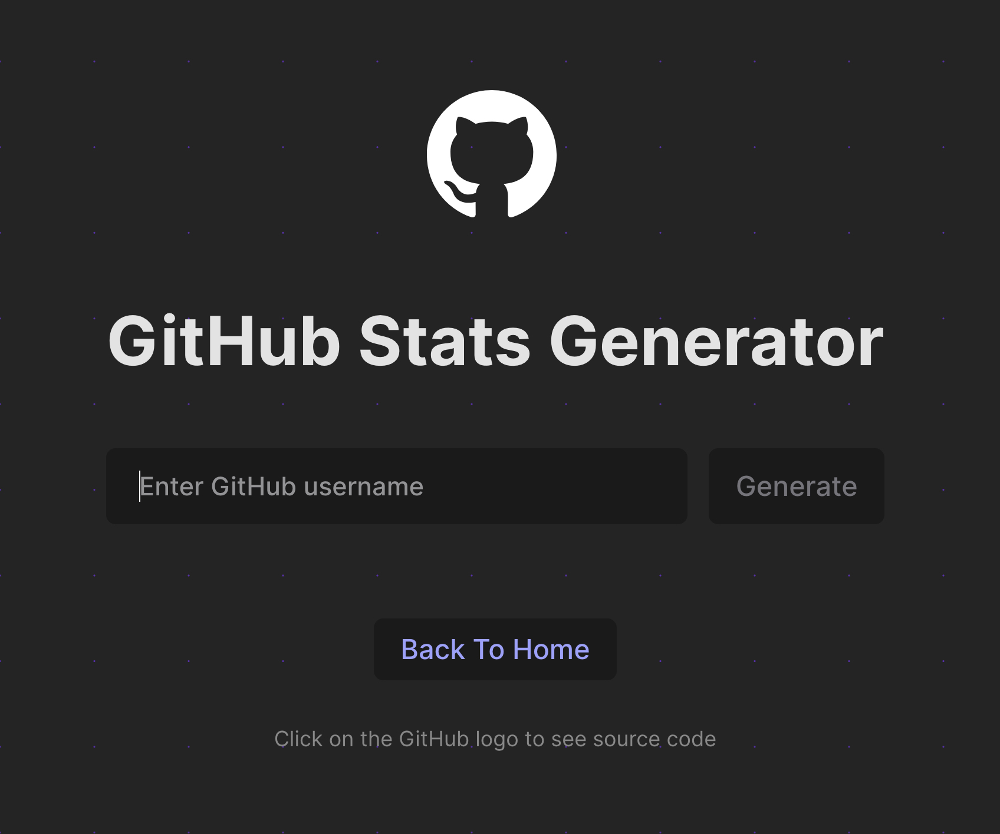

## My Implementation

<h3 align="center">

[🗂️ Source Code](./GitHubCard.jsx)

<h3>

 
 
  
 
 

 

## Workflow

- `main.jsx` component renders `App.jsx` component

- `App.jsx` handles routing with React Router.

- `App.jsx` component renders `HomePage.jsx` component which displays buttons linking to various components. Clicking a button navigates to the respective component page.

- `GitHubCardPage.jsx` renders `GitHubCard.jsx` component. It also has Back button navigates back to `HomePage.jsx`.
