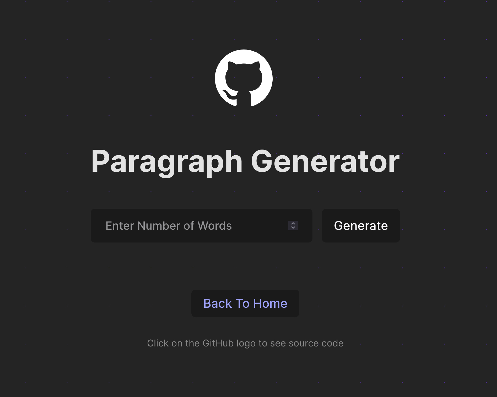
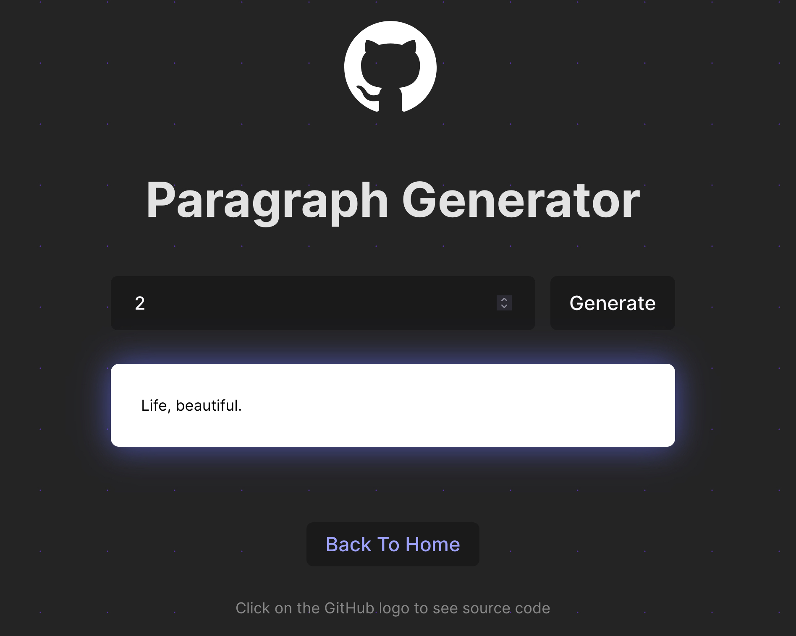

## My Implementation

<h3 align="center">

[🗂️ Source Code](./ParaGenerator.jsx)

<h3>

 
  
 

 

## Workflow

- `main.jsx` component renders `App.jsx` component

- `App.jsx` handles routing with React Router.

- `App.jsx` component renders `HomePage.jsx` component which displays buttons linking to various components. Clicking a button navigates to the respective component page.

- `ParaGeneratorPage.jsx` renders `ParaGenerator.jsx` component. It also has Back button navigates back to `HomePage.jsx`.

- `ParaGeneratoe.jsx` use `Gemini API` for generating paragraph. It uses `gemini-pro` model with the `generateContent()` method to generate text output.