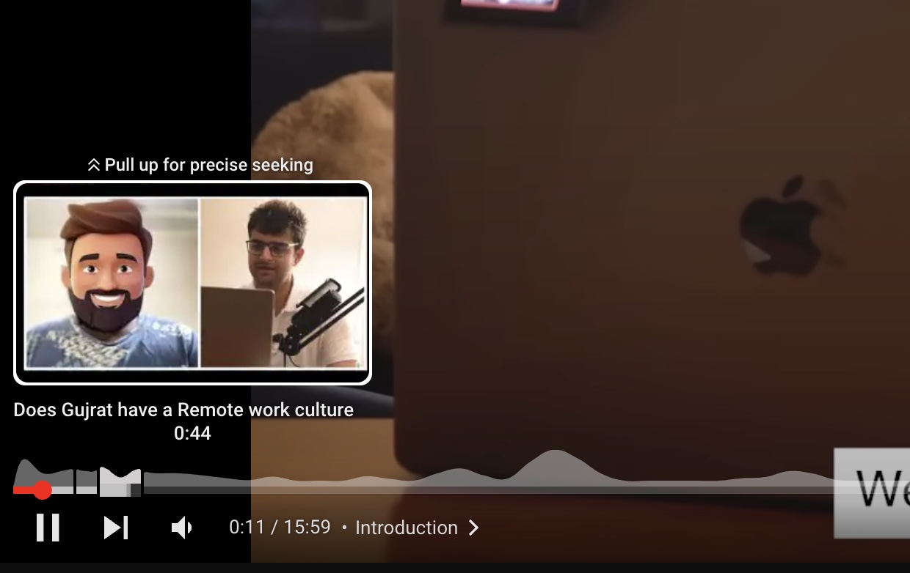

<a href="https://codepen.io/100xdevs/pen/oNmaXxK" target="_blank">
   

    
  

   <h1 align="center">Bounty 1</h1>
</a>

  Deliver a seamless and engaging video journey through interactive&nbsp;navigation&nbsp; functionalities.

 

   
   ### 💰 **Reward: $225** 

 

  <a href="#requirements"><strong>Requirements</strong></a> ·
  <a href="#submission-guidelines"><strong>Submition Guide</strong></a> ·
  <a href="#participations"><strong>Winners</strong></a>

 

### Description:

- This bounty aims to enhance user experience and provide a more interactive way to navigate through video content.

- Explore and contribute to the improvement of the YouTube player seekbar by adding segments.

- Add segments similar to youtube on this <a href="https://codepen.io/100xdevs/pen/oNmaXxK" target="_blank">codebase</a>
    

### Requirements:

1. **Segment Specification:**

   - Implement the ability to specify an array of segments, similar to YouTube's seekbar.

   - Divide the player seekbar into these specified segments.

2. **Scrolling Functionality:**

   - Introduce a function (`scrollToSegment`) that allows users to scroll to the start of a specific segment.

   - Enhance user control and navigation within the video content.

3. **Segment Titles:**

   - Display segment titles corresponding to each segment on the seekbar.

   - Provide clear visual cues for users about the content within each segment.

4. **Skip Functionality:**

   - Include a +5 forward skip and -5 backward skip feature.

   - Enable users to efficiently skip forward or backward within the video.
       

### Submission Guidelines:

1. Utilize the provided CodePen as the base for your modifications.

2. Ensure the added features are production-worthy and aesthetically clean.

3. Submit your contribution in this channel.
     

### Additional Notes:

- The first person to make a successful and polished submission meeting the criteria wins the $150 bounty.

- The implemented code will be integrated into the cohort website, showcasing your work to the entire community.
    

## Winners

🎉 Congratulations to the Bounty Winners! 🎉

1. **Sid**: $50 <a href="https://codepen.io/dustyapi/pen/YzBJqjW" target="_blank">CodePen Link</a>

2. **Rajat Mondal**: $50 <a href="https://codepen.io/Rajat-Mondal/pen/OJdabRM" target="_blank">CodePen Link</a>

3. **Vineet Aagarwal**: $50 <a href="https://github.com/VineeTagarwaL-code/bounty100xdevs" target="_blank">GitHub Link</a>

4. **Mayank**: $25 <a href="https://codepen.io/codescalper/pen/JjxmGVe" target="_blank">CodePen Link</a>

5. **Harshit Jain**: $25 <a href="https://codepen.io/theoopsguy/pen/PoVyZQY" target="_blank">CodePen Link</a>

6. **Aadesh Kulkarni**: $25 <a href="https://codepen.io/Aadesh-Kulkarni-the-typescripter/pen/eYxPZyQ" target="_blank">CodePen Link</a>

Stay tuned for more exciting opportunities in the future.
