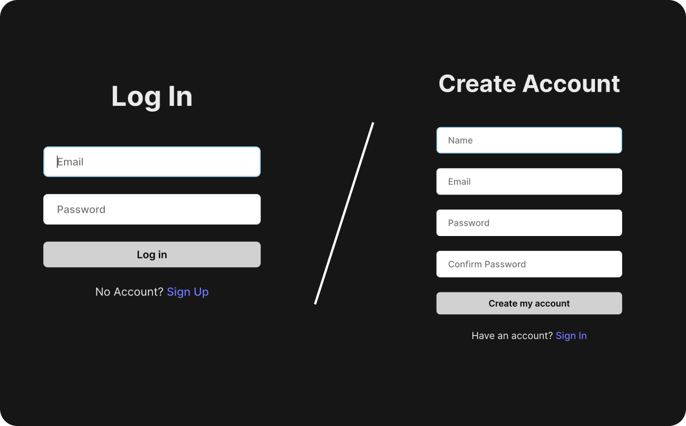
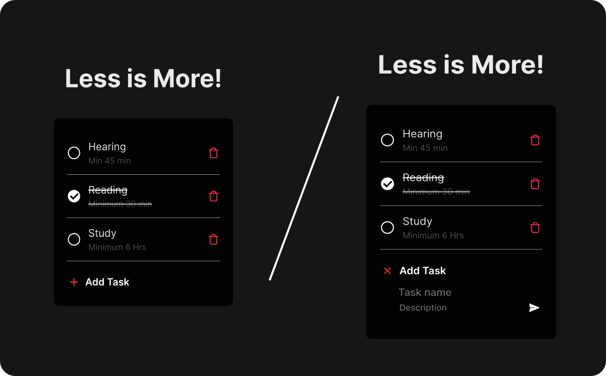

<h3 align="center">

[🗂️&nbsp; Source Code](../client/)

</h3>
<br>

<h1 align="center">Todo Application Frontend</h1>

- This frontend is built to interact with the Todo Application Backend APIs.

- It provides a user interface to manage and organize your todos effectively.

<br>

## User Interface 

<p align=center>
  
<p>
<p align=center>
	
<p>

<br>

## <a name="local-development"> 🖥️&nbsp;&nbsp; Local Development</a>

Follow these steps to set up and run the Todo Application Frontend:

1. **Navigate to the project directory:**

   ```bash
   cd 100xdevs-full-stack-mastery/0-1/projects/basic-to-do-app/client/
   ```

2. **Install dependencies:**

   ```bash
   npm install
   ```

3. **Add Environment Variables:**

	```bash
	touch .env 
	cat >> .env
	VITE_API_BASE_URL = 'enter_api_base_url'
	(Control+D to terminate)  
	```

4. **Run the frontend:**

   ```bash
   npm run dev
   ```

5. **Run the backend:**
	```bash
	cd ../server/
	npm run dev
	```
6. **Open your browser:**

   Visit [http://localhost:5173](http://localhost:5173) to view the project.


	<br>

Feel free to explore frontend implementation and run it locally to verify it's correctness. Happy coding!