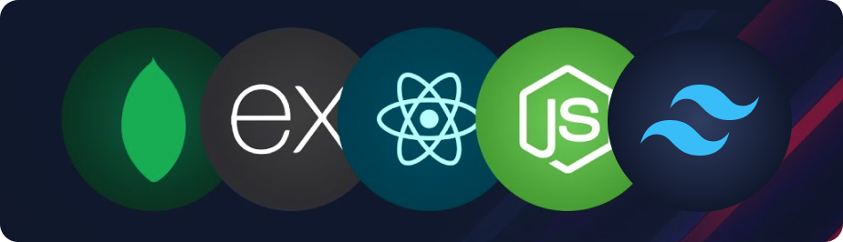
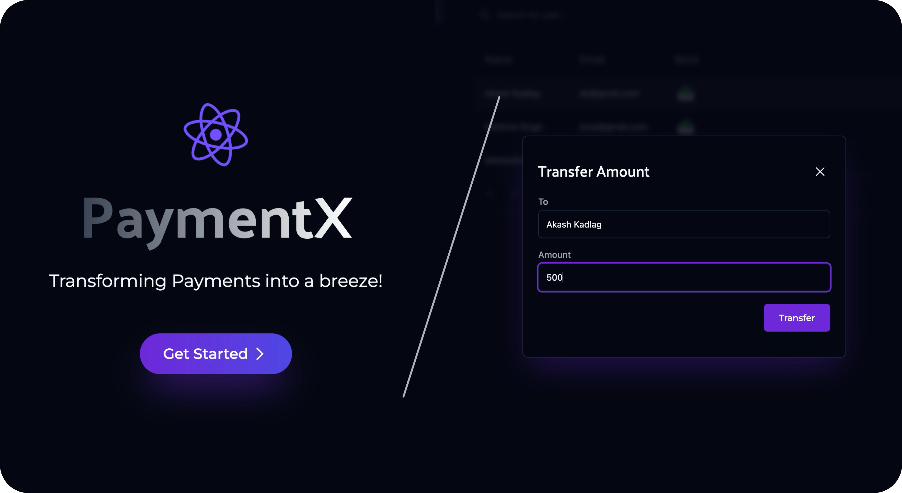

<h1 align="center">Basic Wallet App</h1>

<p align="center">
  A MERN project using Tailwind-CSS for practicing the tech-stack.
</p>

<p align=center>
  
<p>

<div align= "center">

[](https://twitter.com/KadlagAkash) &nbsp; [](https://www.linkedin.com/in/kadlagakash/) &nbsp; [](mailto:akashkadlag14@gmail.com) &nbsp; [](https://conventionalcommits.org)&nbsp; [](https://choosealicense.com/licenses/mit/)

</div>

<h2 align="center">

[🗂️&nbsp; Frontend](./client/README.md)&nbsp;&nbsp;&nbsp;|&nbsp;&nbsp;&nbsp;[Backend &nbsp;📂](./server/README.md)

</h2>
<br>

<p align="center">
  <a href="#introduction"><strong>Introduction</strong></a> 
	·&nbsp;<a href="#features"><strong>Features</strong></a> 
	·&nbsp;<a href="#tech-stack"><strong>Tech Stack</strong></a>
	·&nbsp;<a href="#local-development"><strong>Development Setup</strong></a> 
</p>
<br>

## <a name="introduction">❄️&nbsp; Introduction</a>

To-Do App created during Week-5 of 100xDevs Cohort by Harkirat Singh.

<p align=center>
	
<p>
<br>

## <a name="features">🔋&nbsp; Features</a>

- **Organized File and Folder Structure**: Maintain a well-organized file and folder structure for easy navigation and management.
  <br><br>

## <a name="tech-stack">⚙️&nbsp; Tech Stack</a>

- [MongoDB](https://www.mongodb.com/) – NoSQL database
- [Express](https://expressjs.com/) – Web application framework
- [React](https://react.dev/) – library for building UI
- [Node.js](https://nodejs.org/) – JavaScript runtime
- [Tailwind CSS](https://tailwindcss.com/) – utility-first CSS framework
- [Mongoose](https://mongoosejs.com/) – MongoDB object modeling
- [RESTful API](https://restfulapi.net/) – API design principles
- [Git](https://git-scm.com/) – versioning
- [Vite](https://vitejs.dev/) – building
  <br><br>

## <a name="local-development"> 🖥️&nbsp;&nbsp; Local Development</a>

0.  **Prerequisites** <br>
    Make sure you have the following installed on your machine:

    - [Git](https://git-scm.com/)
    - [Node.js](https://nodejs.org/en)
    - [npm](https://www.npmjs.com/) (Node Package Manager)

1.  **Clone the repository:**

    ```bash
    git clone https://github.com/KadlagAkash/100xdevs-full-stack-mastery.git
    ```

2.  **Navigate to the project directory:**

    ```bash
    cd 100xdevs-full-stack-mastery/0-1/projects/basic-wallet-app/
    ```

<br>

## 🤝&nbsp;&nbsp;Contributing

Contributions are always welcome!

See [CONTRIBUTING.md](../../../CONTRIBUTING.md) for ways to get started.
</br></br>

## 🪪&nbsp;&nbsp; Licensing Information

- It is licensed under the [MIT License](./LICENSE). Feel free to learn, add upon, and share!
