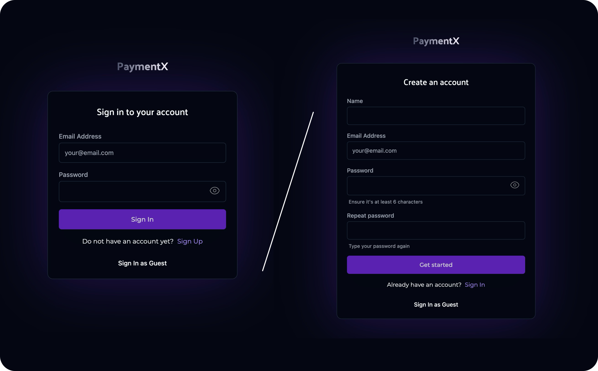
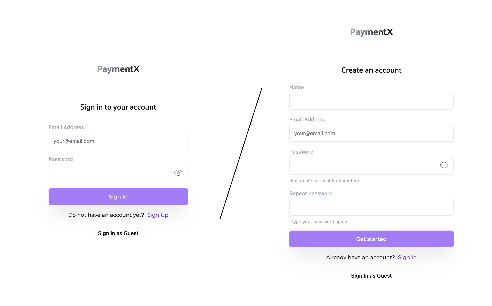
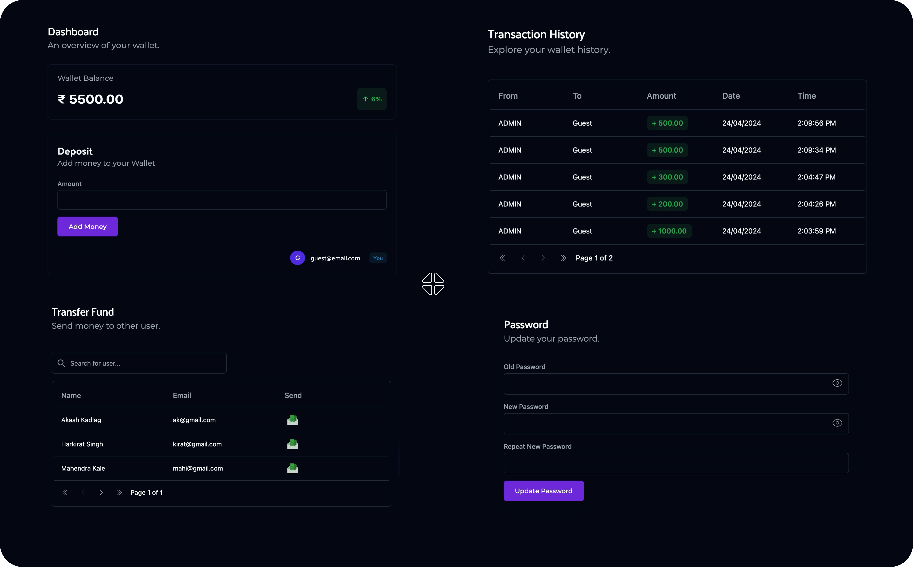
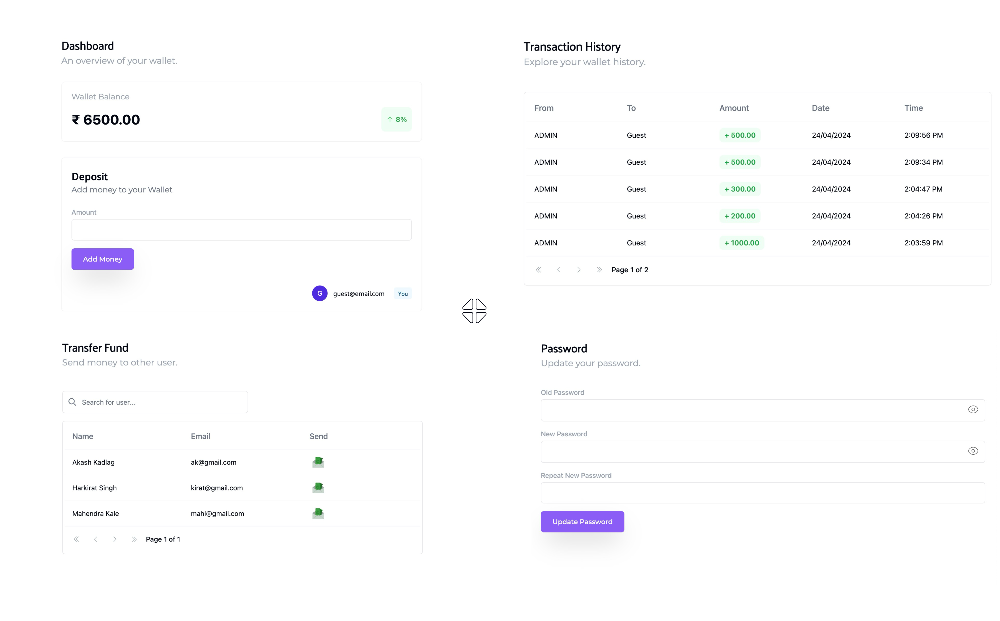

<h3 align="center">

[🗂️&nbsp; Source Code](../client/)

</h3>
<br>

<h1 align="center">Wallet Application Frontend</h1>

- This frontend is built to interact with the Wallet Application Backend APIs.

- It provides a user interface to manage, organize and transfer your funds effectively.

<br>

<h2 align="center">User Interface</h2>

<p align=center>
  
<p>
<br>

<p align=center>
  
<p>
<br>

<p align=center>
  
<p>
<br>


<p align=center>
  
<p>

<h2 align="center">🖥️&nbsp;&nbsp; Local Development</h2>

1. **Navigate to the Frontent Codebase:**

   ```bash
   cd client/
   ```

2. **Install dependencies:**

   ```bash
   npm install
   ```

3. **Add Environment Variables:**

   Create .env file in the root folder and copy paste the content of .env.sample.

   ```bash
   cp .env.sample .env
   ```

   If required, add necessary credentials.

4. **Start the frontend app:**

   ```bash
   npm run dev
   ```

5. **Start the backend server:**

   ```bash
   cd ../server
   npm start
   ```

6. **Open app in browser:**

   Visit [https://localhost:5173](https://localhost:5173) to access frontent.

<br>

Feel free to explore frontend implementation and run it locally to verify it's correctness. Happy coding!
