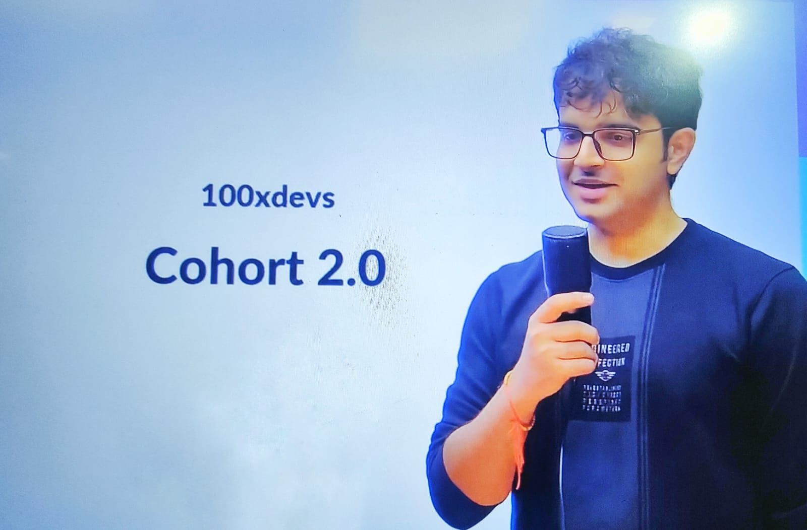

<a href="https://harkirat.classx.co.in/">
  

    
  

  <h1 align="center">100x-Devs Full-Stack Mastery</h1>
</a>

  Showcase of my adventure through the 100xDevs Full Stack Mastery Cohort

 &nbsp;  &nbsp;  &nbsp; &nbsp; 

 

  <a href="#introduction"><strong>Introduction</strong></a> ·
  <a href="#highlights"><strong>Highlights</strong></a> ·
  <a href="#documentation"><strong>Documentation</strong></a> ·
  <a href="#tech-stack"><strong>Tech Stack</strong></a> ·
  <a href="#contributing"><strong>Contributing</strong></a>

 

## Introduction

**100xDevs** is an initiative by **[Harkirat Singh](https://www.youtube.com/@harkirat1)** aimed at mentoring individuals in becoming 100x Engineers. From basics to full-stack mastery, this repository documents my in-depth learning journey within the program.
  

## Highlights

- **Roadmap**: From basics to advanced skills, detailed assignments guide your journey.

- **Master The Stack**: HTML, CSS, JS, TS, React, Express, Mongo, NextJS, DevOps, System Design & more.

- **Killer Portfolio**: Strengthen your portfolio with diverse projects highlighting your skills.

- **Bounty-Hunting**: Dive into creative problem-solving with challenging bounties.

- **Real-world Projects**: See theory in action through practical, real-world projects.
    

## Documentation

### [0-1 Cohort](./0-1/README.md)

The foundational building blocks of my development journey within the 100xDevs program.([Dive In](./0-1/README.md#showcase))

### [1-100 Cohort](./1-100/)

Transforming into a full-stack ninja 🥷: Stay tuned.
  

## Tech Stack

- [AWS](https://aws.amazon.com/) – cloud services

- [CSS3](https://developer.mozilla.org/en-US/docs/Web/CSS) – modular css

- [Docker](https://www.docker.com/) – containerization

- [Git](https://git-scm.com/) – versioning

- [HTML5](https://developer.mozilla.org/en-US/docs/Web/HTML) – structuring

- [JavaScript](https://developer.mozilla.org/en-US/docs/Web/JavaScript) – primary language

- [MongoDB](https://www.mongodb.com/) – NoSQL database

- [MySQL](https://www.mysql.com/) – relational database

- [NGINX](https://www.nginx.com/) – web server

- [Next.JS](https://nextjs.org/) – react framework

- [NodeJS](https://nodejs.org/) – js runtime

- [React](https://reactjs.org/) – js library for UI

- [Tailwind](https://tailwindcss.com/) – css framework

- [TypeScript](https://www.typescriptlang.org/) – typed javaScript

- [Vercel](https://vercel.com/) – deployments
  

## Contributing

Contributions are always welcome! 

See [CONTRIBUTING.md](./CONTRIBUTING.md) for ways to get started.
  

## Related

Here are some related projects

- [Official - 100xDevs Cohort 2](https://github.com/100xdevs-cohort-2/assignments)

- [Ajaydeep Singh Rajpoot - 100xdevsCohort](https://github.com/Ajaydeep123/100xdevsCohort)

- [Vishal Singh - 100xDevs_2.0](https://github.com/vishalsingh2972/100xDevs_2.0)

- [Kandepi Bhavani - 100xDevs-Cohort-2.0](https://github.com/KandepiBhavani23/100xDevs-Cohort-2.0)

- [Piyush Sharma - 100xDevs](https://github.com/piyusharmap/100xDevs)

- [Taha Iftikhar- 100Xdevs](https://github.com/dexter-ifti/100Xdevs)
  

## License

This project is licensed under the [MIT License](./LICENSE). &nbsp;Feel free to learn, add upon, and share my work!
